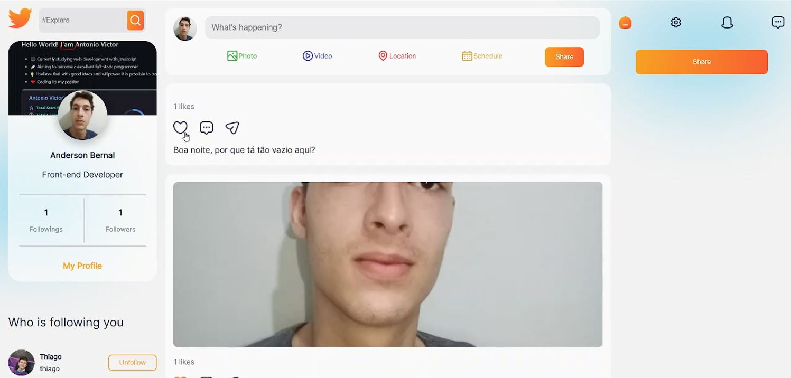

# Talkania

## Preview



### Prerequisites

Before we start, you must download the following tools:
[Node.js](https://nodejs.org/en/), [MongoDB](https://www.mongodb.com/docs/manual/installation/)

### Building a docker compose and running it

```
    # Clone the application with git clone
    git clone https://github.com/andersonrbernal/talkania.git
    # Build the client image
    docker build -t <imagename:version> ./client/
    # Build the server image
    docker build -t <imagename:version> ./server/
    # Docker Compose
    docker compose up // this will automatically run the application
    # Go to your web browser on localhost:5173
```

### Running the project

```
    # Clone this repository
    git clone https://github.com/andersonrbernal/talkania.git ./

    # Go to the client folder
    cd client 
    # Install the dependencies for the client side 
    npm install
    # Run the front-end
    npm run dev

    # The website will run on port 5173

    # Go to the server folder
    cd server
    # Install the dependencies for the server side
    npm install
    # Run the back-end
    npm start

    # The server will run on port 3000
```

### Technologies

The following packages were used in this project:

- [Node.js](https://nodejs.org/en/)
- [Express](https://expressjs.com/pt-br/)
- [React](https://pt-br.reactjs.org/)
- [TypeScript](https://www.typescriptlang.org/)
- [MongoDB](https://www.mongodb.com/)
- [TypeScript](https://www.typescriptlang.org/)
- [Redux](https://redux.js.org/)

